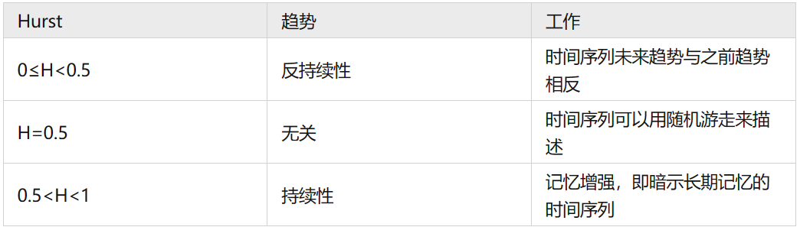

# 开发笔记

## RayMarching体积云


### Ray-Marching 体积云 Ⅰ- Frame

下面开始构建体积云框架

准备好三个脚本CustomRenderPass，CustomRenderFeature，VolumetircCloud，修改之前代码的CustomSettings，分离出renderpass和renderfeature两个类。

注意点：

- 如果引入了#include "Packages/com.unity.render-pipelines.core/Runtime/Utilities/BlitColorAndDepth.hlsl"头文件，里面已经定义好了Vertex着色器，采用的方式是顶点实例化ID，目前正常的顶点着色器好像无法正确进行坐标读入与转换，幸，屏幕空间效果仅需要positionCS和uv，已经在该头文件中处理好，可以集中精力书写fragment部分即可。
- 直接使用的顶点着色器为#pragma vertex Vert，自定义frag的输入参数为“Varyings input”
- 通过*FragColorAndDepth(input)*可以访问color和depth属性。
- 同一，系统内置了屏幕RT纹理，外部传入时默认使用名为“BlitTexture”的2D纹理接收，这也是之前定义private static readonly int BlitTextureID = Shader.PropertyToID("BlitTexture")的原因，也可以在shader中定义别的名称接收其他用到的RT，采样格式如下：

```c#
//Properties中:
_MainTex ("Texture", 2D) = "white" {}

//HLSLINCLUDE中:
CBUFFER_START(UnityPerMaterial)
	float4 _MainTex_ST;
	float4 _ColorTint;
CBUFFER_END
TEXTURE2D(_MainTex);
SAMPLER(sampler_MainTex);
   
//frag中：
half4 col = SAMPLE_TEXTURE2D(_MainTex, sampler_MainTex, input.texcoord);
```

接下来第一步，光线步进的原理，回顾3.0可知，是从相机沿某一方向发射射线，在一个范围内，按步长收集每个采样点的浓度和光强进行着色。现在我们有了裁剪空间的坐标和屏幕uv，我们需 要重建世界空间坐标。

这里补一句UV和positionCS关系：

```c++
float2 UV = positionHCS.xy / _ScaledScreenParams.xy;
//后面这个值会考虑渲染目标的任何比例的缩放
```

重建世界空间坐标需要引入深度头文件

#include "Packages/com.unity.render-pipelines.universal/ShaderLibrary/DeclareDepthTexture.hlsl"

然后使用SampleSceneDepth采样屏幕上一点的原始深度，用NDC空间坐标和深度计算裁剪空间坐标，

```glsl
 float4 positionCS = float4(positionNDC * 2.0 - 1.0, deviceDepth, 1.0);
```

之后左乘投影视图逆矩阵还原到世界空间坐标，

```glsl
float4 hpositionWS = mul(invViewProjMatrix, positionCS);
```

再进行归一化。

```glsl
return hpositionWS.xyz / hpositionWS.w;
```

以上操作封装到了函数ComputeWorldSpacePosition(float2 positionNDC, float deviceDepth, float4x4 invViewProjMatrix)中，读者直接代入相应的量即可。

```c++
ComputeWorldSpacePosition(UV, depth, UNITY_MATRIX_I_VP)
```


得到世界空间坐标后，可以继续进行步进射线的还原：

```glsl
float3 positionWS = GetWorldPosition(input.positionCS);
float3 rayPosition = _WorldSpaceCameraPos.xyz;
float3 worldViewVector = positionWS - rayPosition;
float3 rayDir = normalize(worldViewVector);
```

接下来进行简单的步进测试以保证我们之前的步骤均正确：

定义步进距离，步进位置，累计浓度：

```c++
float3 stepVec = rayDir * 0.5; // 步进向量，由长度值乘方向得到
float3 currentPoint = rayPosition; // 采样点世界坐标，初始位置为相机的位置
float totalDensity = 0;
```

我们将在世界空间坐标（0，0，0）到（10，10，10）中测试效果，因此请确保相机在这个范围附近，原点在相机屏幕内，可以放一些物体做参照。

```c++
for (int i = 0; i < 128; i++)//采样128个点
{
    //步进
    currentPoint += stepVec;
    //检测得到的采样点是否处于一个长宽高为10的正方体内
    if (currentPoint.x > 0 && currentPoint.y > 0 && currentPoint.z > 0 &&
        currentPoint.x < 10 && currentPoint.y < 10 && currentPoint.z < 10)
        totalDensity += 0.02;//浓度增加
}
```

我们将屏幕RT和这个浓度值相加得到如下的表现：


但是目前还存在遮挡关系错误的问题（屏幕效果覆盖在所有物体上），接下来我们将利用AABB包围盒修复这个问题。

### Ray-Marching 体积云 Ⅱ - Occlusion & Shape

首先解决遮挡关系错误的问题：

```glsl
 half2 RayBoxDst(half3 boundsMin, half3 boundsMax, half3 rayOrigin, half3 rayDir)
        {
            //给定包围盒起始和终点，光线原点和光线方向，返回光线到包围盒距离和包围盒内部（沿光线方向）距离
            // 通过boundsMin和boundsMax锚定一个长方体包围盒
            // 从rayOrigin朝rayDir发射一条射线，计算出射线到包围盒的距离

            half3 t0 = (boundsMin - rayOrigin) / rayDir;
            half3 t1 = (boundsMax - rayOrigin) / rayDir;
            half3 tmin = min(t0, t1);
            half3 tmax = max(t0, t1);

            half dstA = max(max(tmin.x, tmin.y), tmin.z);
            half dstB = min(tmax.x, min(tmax.y, tmax.z));

            half dstToBox = max(0, dstA);
            half dstInsideBox = max(0, dstB - dstToBox);
            return half2(dstToBox, dstInsideBox);
        }
```

该函数有NVIDIA提出，用来指定包围盒起点与终点的情况下，计算出光线到包围盒的距离和包围盒内部的距离。

若体积中有不透明物体在遮挡，则这个距离就是到物体视线向量转换到世界坐标系中的到物体向量的模。

```glsl
 half dstToOpaque = length(worldViewVector); //当前片元在世界空间中的位置（相对摄像机）
//其中，worldViewVector=positionWS - rayPosition
```

我们需要利用这个值算出我们的体积步进限制范围即可：

```glsl
half dstLimit = min(dstToOpaque - dstToBox, dstInsideBox);
```

在密度循环外面添加距离计算变量

```c#
 half dstTravelled = 0; //记录已经走过的距离
 
// 循环内：
if (dstTravelled < dstLimit){
// ……
dstTravelled += _StepSize;
}
```

修复遮挡关系：


接下来是云的初始形状，我们需要使用3D噪声，这里的基础噪声有perlin噪声，worley噪声，voronori噪声，以及他们的混合体和fBM分型体。

> [!NOTE]
>
> *噪声的制作方式：可以在Substance Designer中烘焙一个3D噪声，导出后，在Unity里设置成3D模式，长宽为16*16，因为大部分3D纹理的制作方式是n个2维纹理叠加而成。*


现在循环体内的代码变成了：

```glsl
half getDensity = sampleDensity(currentPoint);
totalDensity += getDensity * stepSize;
currentPoint += stepVec;
dstTravelled += stepSize;
```

密度采样函数如下，这里新增了几个控制参数分别表示噪音纹理的缩放和偏移。

```glsl
half sampleDensity(half3 position)
{
    // 用世界坐标采样3d纹理
    // 缩放和偏移参数自己调试即可，参考缩放（0.1，0.1，0.1）
    half3 uvw_baseNoise = position * _NoiseScale + _NoiseOffset;
    half4 baseNoise_Original = SAMPLE_TEXTURE3D_LOD(_BaseNoiseTex, sampler_BaseNoiseTex, uvw_baseNoise, 0);
    half baseDensity = baseNoise_Original.r;

    half sampleDensityResult = baseDensity;
    return sampleDensityResult;
}
```


### Ray-Marching 体积云 Ⅲ - Absorption & Scatter

接下来需要基于之前的体渲染方程，进行光照的计算和吸收和散射的模拟。

**吸收**

定义我们的吸收系数：

```
half _Absorption;
half _LightAbsorption;
```

吸收有两部分，一部分是从光线到摄像机，另一部分是从采样点到摄像机；每一次步进采样都是在上一次的基础上叠加两个量，一个是**光线内散射的衰减后的值**，一个是**本身步进的衰减后的值**。

先考虑采样点到摄像机的视线衰减：这里用的是前向光线步进(对前面3.0内容的实现)。

各向异性物体有采样密度环节。

```glsl
float sample_attenuation = exp(-sampleDensity(currentPoint)*step_size * sigma_a);
//transparency=exp(-sample_density*_Absorption)
```

然后是光线到采样点的衰减

```glsl
float lightPathDensity = LightPathDensity(currentPoint, min(_LightStepCount, 12));
float light_attenuation=exp(-lightPathDensity*_LightAbsorption);
//float light_attenuation = exp(-isect_vol.t1 * sigma_a);
```

光源到采样点的衰减本质上又是一次光线步进：

```glsl
half LightPathDensity(half3 position, int stepCount)
{
    //每个步进采样点到光源的密度衰减
    //position：当前采样点
    half3 L = normalize(_MainLightPosition.xyz);
    half3 lightDir = normalize(_MainLightPosition.xyz - position);
    half dstInsideBox = RayBoxDst(_CloudMinDis, _CloudMaxDis, position, 1 / L).y;
    //注意这里不是lightDir，也不是-lightDir，而是1/L
    half stepSize = dstInsideBox / stepCount;
    half totalDensity = 0;
    half3 stepVec = lightDir * stepSize;
    half dsttravelled = 0;
    for (int i = 0; i < stepCount; i++)
    {
        if (dsttravelled < dstInsideBox)
        {
            half getDensity = sampleDensity(position);
            position += stepVec;
            dsttravelled += stepSize;
            totalDensity += max(0, getDensity * stepSize);
        }
    }
    return totalDensity;
}
```

合二为一（光源到采样点，采样点到摄像机）：

```glsl
half Density = exp(-(lightPathDensity * _LightAbsorption + totalDensity * _Absorption)) *sampledensity;
//result += transparency  * light_attenuation * sample_density * light_color;
//这里是一次循环，最终结果运算叠加为一个realLightDensity
```

之后我们的云层颜色就是：

```glsl
float3 cloudColor = _MainLightColor.xyz * realLightDensity * _ColorTint.xyz * _LightPower;
```

和视线衰减做一次叠加：

```glsl
half3 finalColor = col.xyz * exp(-(totalDensity) * _Absorption) + cloudColor;
//return background_color * transparency + result;
```


给出具体循环代码：

```glsl
for (int i = 0; i < _StepCount; i++)
{ 
    if (dstTravelled < dstLimit)
    {
        half sampledensity = sampleDensity(currentPoint) * _StepSize * _DensityScale;
        half lightPathDensity = LightPathDensity(currentPoint, min(_LightStepCount, 12));
        totalDensity += sampledensity;
        half3 Density = exp(-(lightPathDensity * _LightAbsorption + totalDensity * _Absorption)) *
            sampledensity;
        realLightDensity += Density;
        currentPoint += stepVec;
        dstTravelled += _StepSize;
    }
}
```

目前参数栏如下所示：


Absorption用来控制吸收系数，LightAbsorption用来控制光路上的吸收系数，Density Scale用来控制密度缩放，Light Power用来控制光线强度。

**散射**

我先们给出需要的参数，参考上图，G0,G1分别是控制前向和后向散射的参数，Scatter Weight可用来控制前向后向散射比率和支持双瓣相位函数。

散射概念需要用到相位函数，即决定光线向某个方向发射出去的概率，通常由瑞利散射和米氏散射两个概念，我们模拟云雾时用到的大多是米氏散射。常用的函数为HG亨利·格林斯坦函数，具体数学表达式可以参考3.0相位函数部分。

下面给出代码表达：

```glsl
half HGFunction(half costheta, half g)
{
    //normally,g=0.8
    half g2 = g * g;
    return (1 - g2) / (PI4 * pow(abs(1 + g2 - 2 * g * costheta), 1.5));
}
 //双瓣相位函数
half DoubleLobePhaseFunction(half costheta, half g0, half g1, half weight)
{
    return lerp(HGFunction(costheta, g0), HGFunction(costheta, g1), weight);
}
```

控制前向散射和后向散射：

```glsl
loat costheta = dot(rayDir, _MainLightPosition.xyz);
half phase = HGFunction(costheta, _G0);
half phase_1 = HGFunction(costheta, _G1);
//使用双瓣相位函数，用来弥补视线与光线悖逆时，亮度不够的情形
half doublephase = DoubleLobePhaseFunction(costheta, _G0, _G1, _ScatterWeight);
```

循环中对密度叠加只要做一点修改：

```glsl
realLightDensity += Density * doublephase;
```

以下是开启了散射和未开启散射的对比，均使用相同的参数：

<center>
    
    
    


从左到右依次是，开启散射各向异性，开启散射各向同性，关闭散射各向异性。

### Ray-Marching 体积云 Ⅳ - Shape Carving

关注点1：云层基础区域


使用一张2D贴图，白色区域代表有云以及云层的厚度，黑色代表无云。

```glsl
half3 size = _CloudMaxDis - _CloudMinDis;
half2 uv_weatherMap = position.xz / max(size.x, size.z) * _WeatherMapScale + (_WeatherMapOffset*_Time.y/100);
half3 weatherMap = SAMPLE_TEXTURE2D_LOD(_CloudAreaTex, sampler_CloudAreaTex, uv_weatherMap, 0).rgb;
```

需要对整个包围盒进行uv分配，因此首先计算出盒子的底面长度size。

对于每个采样点position，取长边作为uv=1的对应进行uv分配。

关注点2：云层细节侵蚀


```glsl
half3 uvw_ErodeNoise = position * _ErodeScale + _ErodeOffset;
half4 ErodeNoise_Original = SAMPLE_TEXTURE3D_LOD(_ErodeNoiseTex, sampler_ErodeNoiseTex, uvw_ErodeNoise, 0) *
    _ErodeStrength;

//用基础浓度减去侵蚀浓度得到云层
half sampleDensityResult = max(0, baseDensity - erodeDensity) * _DensityScale;
```

对云层边缘作柔化处理，去掉包围盒的硬直边缘：

```glsl
float edgeToX = min(_EdgeSoftnessThreshold.x,min(position.x - _CloudMinDis.x, _CloudMaxDis.x - position.x));
float edgeToZ = min(_EdgeSoftnessThreshold.z,min(position.z - _CloudMinDis.z,_CloudMaxDis.z - position.z));
float edgeToY = min(_EdgeSoftnessThreshold.y,min(position.y - _CloudMinDis.y,_CloudMaxDis.y - position.y));
float softness = edgeToX / _EdgeSoftnessThreshold.x * edgeToZ / _EdgeSoftnessThreshold.z * edgeToY /_EdgeSoftnessThreshold.y;
```

最后返回的浓度值为：

```glsl
return sampleDensityResult * softness * softness * weatherMap.r
```

糖粉效应：云层边缘偏暗

```glsl
float3 BeerPowder(float3 d, float a)
{
    return exp(d * a) * (1 - exp(d * 2 * a));
}
```

使用该函数替换掉exp计算光线散射的部分。

```glsl
half3 Density = exp(-totalDensity * _Absorption * lcolor)
    * BeerPowder(-lightPathDensity * _LightAbsorption * lcolor, 6)
    * sampledensity * lcolor;
```

## FFT 海洋


对于水平位置$\bold x=(x,z)$，定义其高度$height\quad h(\bold x,t)$
$$
h(x,t)=\sum_\vec k\tilde{h}(\vec k,t)e^{i\vec k\cdot \vec x}&&(1)\\
\tilde{h}(\vec k,t)=\tilde{h}_{0}(\vec k)e^{i\omega(||k||)t}+\tilde{h}_{0}^{\star}(-\vec k)e^{-i\omega(||k||)t}&&(2)\\
{\tilde{h}_{0}}(\vec k)=\frac{1}{\sqrt{2}}(\xi_{r}+i\xi_{i})\sqrt{P_{h}(\vec k)}&&(3)\\
P_h(\vec k)=\frac{A\left(\exp\left(-\frac{1}{(||k||L)^2}\right)\right)}{{\vec k}^4}\left|\vec k\cdot\vec w\right|^2&&(4)
$$
波谱$P_h(k)$有很多种，常用模拟风造成波浪的的有Phillips Spectrum。

(1)式是频域变换到时（空）域，定义$L$为海面尺寸，对于游戏而言，通常取$N=64$就够用了，即$64^2=4096$个频率点，亦即$4096$个不同频率正弦信号叠加，公式里的$k$是角频率。

- $\vec{x}=(x,z)$是空域坐标，$\vec{k}=(k_x,k_z)$是频域坐标，$\tilde{h}(\vec k,t)$​是频谱，参数t表示频谱随时间变化。
- $i\vec k\cdot \vec x$表示$i(k_{x}x+k_{z}z)$，在$x$固定的情况下，只变化$z$时的频率为$k_z$；在$z$固定的情况下，只变化$x$时的频率为$k_x$​；
- 对$\vec k$进行求和，即在频谱平面上进行采样：
  - 以原点为中心，每隔$\frac{2\pi}{L}$取一个点，共$N\times N$​个点：
    - $k_x=\frac{2\pi n}L, n\in\{-\frac N2,-\frac N2+1,\ldots,\frac N2-1\}$
    - $k_z=\frac{2\pi m}L, m\in\{-\frac N2,-\frac N2+1,\ldots,\frac N2-1\}$
- 在$xz$平面上，同样以原点为中心，每隔$\frac{L}{N}$取一个点，共$N\times N$​个点：
  - $x=\frac{uL}N, u\in\{-\frac N2,-\frac N2+1,\ldots,\frac N2-1\}$
  - $z=\frac{vL}N, v\in\{-\frac N2,-\frac N2+1,\ldots,\frac N2-1\}$​

- 若要海面patch可以无缝tiling，$h(\bold x,t)$应以$L$为周期，对于角频率$\vec k$来说，周期$T=\frac{2\pi}{k}$，$L/T=\frac{L}{2\pi/(2\pi n/L)}=n$在$N$为偶数的情况下，$n$是整数，因此$h(\bold x,t)$的确以$L$​为周期。


（2）-（4）式源于海洋统计学。

(2)式采用的就是Phillips Spectrum。

- $||k||$取模后，$\omega(||k||)=\sqrt{g||k||}$，$g$是重力加速度。（后公式中$k$代表模）

(3)式中，

- $\xi_{r}$和$\xi_{i}$​是相互独立的随机数，服从均值为0，标准差为1的正态分布。

(4)式中，

- 此处的$L=\frac{V^2}{g}$，$V$​是风速。
- $w$​是风向。
- A是振幅。


**法线**

（1）差分近似：取周围的8个点算出两个法线再取平均。

- 计算左右点高度差向量和上下点高度差向量，叉乘得到向量1，对角差向量同样操作得到向量2，这两个向量取平均。

（2）解析式：通过梯度的方式。

- 对位置求导得空间梯度，$\bigtriangledown  h(x,t)=\sum_\vec k\tilde{h}(\vec k,t)\bigtriangledown e^{i\vec k\cdot \vec x}$​，

  - $$
    \begin{aligned}
    &\bigtriangledown e^{i\vec{k}\cdot\vec{x}}=(\frac{\partial e^{i(k_x*x+k_z*z)}}{\partial x},\frac{\partial e^{i(k_x*x+k_z*z)}}{\partial z}) \\
    &=(e^{i(k_x*x+k_z*z)}*ik_x,e^{i(k_x*x+k_z*z)}*ik_z) \\
    &=e^{i(k_x*x+k_z*z)}*i(k_x,k_z) \\
    &=i\vec{k}e^{i\vec{k}\cdot\vec{x}}
    \end{aligned}
    $$

    即$\triangledown h(\vec{x},t)=\sum_{\vec{k}}i\vec{k}\tilde{h}(\vec{k},t)e^{i\vec{k}\cdot\vec{x}}$，梯度向量的模就是斜率，有几何关系：$\vec {up}+-\vec {grad}=\vec N$。

    所以，$\vec N=normalize(-\triangledown h_x(\vec{x},t),1,-\triangledown h_z(\vec{x},t))$。


**浪尖**

挤压IDFT海面得到泡沫：即对sin波进行cos挤压，对cos波进行sin挤压。
$$
\vec{D}(\vec{x},t)=\sum_{\vec{k}}-i\frac{\vec{k}}k\tilde{h}(\vec{k},t)e^{i\vec{k}\cdot\vec{x}}\\
\vec D_x=\sum_{\vec{k}}-i\frac{k_x}k\tilde{h}(\vec{k},t)e^{i\vec{k}\cdot\vec{x}}\\
\vec D_z=\sum_{\vec{k}}-i\frac{k_z}k\tilde{h}(\vec{k},t)e^{i\vec{k}\cdot\vec{x}}
$$
得到挤压后的点$\vec{x}’=\vec{x}+\lambda\vec{D}(\vec{x},t)$。

当海浪发生汇聚时，会出现刺穿现象，即泡沫区域面元**有向面积**变为负值。现要计算$\vec{x}’$和$\vec x$​能构成的微元面积。

由二重积分换元法，
$$
f(\begin{bmatrix}x\\z\end{bmatrix})
=\begin{bmatrix}x'\\z'\end{bmatrix}
=\begin{bmatrix}f_1(x,z)\\f_2(x,z)\end{bmatrix}
=\begin{bmatrix}x+\lambda \vec D_x\\ z+\lambda \vec D_z\end{bmatrix}
$$

$$
dA=\begin{bmatrix}\frac{\partial f_1}{\partial x}&\frac{\partial f_1}{\partial z}\\\\\frac{\partial f_2}{\partial x}&\frac{\partial f_2}{\partial z}\end{bmatrix}dxdz
=\begin{bmatrix}1+\lambda {D}_{xx}&\lambda {D}_{xz}\\\\\lambda {D}_{zx}&1+\lambda {D}_{zz}\end{bmatrix}dxdz
$$

由挤压公式可得：
$$
{D}_{xx}=\frac{\partial D_x}{\partial x}
=\sum_{\vec{k}}-i\frac{k_x}k\tilde{h}(\vec{k},t)e^{i\vec{k}\cdot\vec{x}}\cdot ik_x
=\sum_{\vec{k}}\frac{{k_x}^2}{k}\tilde{h}(\vec{k},t)e^{i\vec{k}\cdot\vec{x}}
\\
{D}_{xz}={D}_{zx}=\frac{\partial D_x}{\partial z}
=\sum_{\vec{k}}-i\frac{k_z}k\tilde{h}(\vec{k},t)e^{i\vec{k}\cdot\vec{x}}\cdot ik_z
=\sum_{\vec{k}}\frac{{k_x}{k_z}}{k}\tilde{h}(\vec{k},t)e^{i\vec{k}\cdot\vec{x}}
\\
{D}_{zz}=\frac{\partial D_z}{\partial z}
=\sum_{\vec{k}}-i\frac{k_x}k\tilde{h}(\vec{k},t)e^{i\vec{k}\cdot\vec{x}}\cdot ik_z
=\sum_{\vec{k}}\frac{{k_z}^2}{k}\tilde{h}(\vec{k},t)e^{i\vec{k}\cdot\vec{x}}
$$
**基2 IFFT**

根据DFT和IDFT的定义，模仿DFT的基2FFT算法，我们可以推导出IDFT的基2IFFT算法：

依旧用两个N/2点的 IDFT calculator去构造一个N 点的IDFT calculator。将序号为偶数的输入给到第一个N/2 point IDFT calculator，序号为奇数的输入给到第二个N/2 point IDFT calculator。
$$
\begin{aligned}
&x(n)=\frac{1}{N}\sum_{n=0}^{N-1}X(k)e^{i\frac{2\pi kn}N} \\
&=\frac{1}{N}\sum_{n=0}^{N/2-1}X(2k)e^{-i\frac{2\pi n(2k)}N}+\frac{1}{N}\sum_{n=0}^{N/2-1}X(2k+1)e^{-i\frac{2\pi n(2k+1)}N} \\
&=\frac{1}{N}\sum_{n=0}^{N/2-1}X(2k)e^{-i\frac{2\pi nk}{N/2}}+\frac{e^{i\frac{2\pi n}N}}{N}\sum_{n=0}^{N/2-1}X(2k+1)e^{-i\frac{2\pi nk}{N/2}} \\
&=x_1(n)+{e^{i\frac{2\pi n}N}}x_2(n)\\
&=x_1(n)+W_N^{-n}x_2(n)
\end{aligned}
$$
简化形式：
$$
x(n)=\frac{1}{N}\sum_{k=0}^{N-1}X(k)W_{N}^{-nk}=\sum_{k\text{为偶数}}X(k)W_N^{-n}+\sum_{k\text{为奇数}}X(k)W_N^{-n}\\
=x_1(n)+W_N^{-n}x_2(n) & 0\leq n\leq \frac{N}{2}-1
$$
这里得到了前一半的抽样点，后一半如何处理？
$$
x(n)=x_1(n)+W_N^{-n}x_2(n) \\
\Longrightarrow x(n+\frac{N}{2})=x_1(x+\frac{N}{2})+W_N^{-n+\frac{N}{2}}x_2(n+\frac{N}{2}) \\
根据x(n)的周期性，以\frac{N}{2}为周期的x(\frac N2+n)=X(n)，根据旋转因子的性质，W_N^{(n+N/2)}=-W_N^n\\
\Longrightarrow x(n+\frac{N}{2})=x_1(n)-W_N^{-n}x_2(n)
$$
接下来进入对洋面最后的模拟。

展开洋面高度方程：
$$
h(x,z,t)=\sum_{m=-\frac N2}^{\frac N2-1}\sum_{n=-\frac N2}^{\frac N2-1}\tilde{h}(k_x,k_z,t)e^{i(k_xx+k_zz)}
$$
代入$k_x,k_z$采样点：
$$
h(x,z,t)=\sum_{m=-\frac N2}^{\frac N2-1}\sum_{n=-\frac N2}^{\frac N2-1}\tilde{h}(\frac{2\pi n}L,\frac{2\pi m}L,t)e^{i(\frac{2\pi n}Lx+\frac{2\pi m}Lz)}
$$
令$n'=n+\frac{N}{2},m'=m+\frac{N}{2}$，重新映射下标：
$$
h(x,z,t)=\sum_{m^{\prime}=0}^{N-1}\sum_{n^{\prime}=0}^{N-1}\tilde{h}(\frac{2\pi(n^{\prime}-\frac N2)}L,\frac{2\pi(m^{\prime}-\frac N2)}L,t)e^{i(\frac{2\pi(n^{\prime}-\frac N2)}Lx+\frac{2\pi(m^{\prime}-\frac N2)}Lz)}
$$
重新整理，得：
$$
\tilde{h}^{'}(n^{\prime},m^{\prime},t)=\tilde{h}(\frac{2\pi(n^{\prime}-\frac{N}{2})}{L},\frac{2\pi(m^{\prime}-\frac{N}{2})}{L},t)\\
h(x,z,t)=\sum_{m^{\prime}=0}^{N-1}e^{i\frac{2\pi(m^{\prime}-\frac N2)z}L}\sum_{n^{\prime}=0}^{N-1}\tilde{h}^{\prime}(n^{\prime},m^{\prime},t)e^{i\frac{2\pi(n^{\prime}-\frac N2)x}L}
$$
继续替换，得：
$$
h(x,z,t)=\sum_{m^{\prime}=0}^{N-1}h^{\prime\prime}(x,m^{\prime},t)e^{i\frac{2\pi(m^{\prime}-\frac N2)z}L}\\\tilde{h}^{\prime\prime}(x,m^{\prime},t)=\sum_{n^{\prime}=0}^{N-1}\tilde{h}^{\prime}(n^{\prime},m^{\prime},t)e^{i\frac{2\pi(n^{\prime}-\frac N2)x}L}
$$
==令$L=N$==，得：
$$
h(x,z,t)=(-1)^z\sum_{m^{\prime}=0}^{N-1}\tilde{h}^{\prime\prime}(x,m^{\prime},t)e^{i\frac{2\pi m^{\prime}z}N}\\\tilde{h}^{\prime\prime}(x,m^{\prime},t)=(-1)^x\sum_{n^{\prime}=0}^{N-1}\tilde{h}^{\prime}(n^{\prime},m^{\prime},t)e^{i\frac{2\pi n^{\prime}x}N}
$$

> [!IMPORTANT]
>
> 此处使用了欧拉公式$e^{i\pi}=-1$；
>
> 取L=N，不仅可以化简公式，还能简化对空域点的采样。

代入$x,z$​采样点：
$$
\begin{aligned}x&=\frac{uL}N=u\\\\z&=\frac{vL}N=v\end{aligned}
$$
同样的，令$u'=u+\frac{N}{2},v'=v+\frac{N}{2}$​，重新映射下标：
$$
h(u,v,t)=(-1)^v\sum_{m^{\prime}=0}^{N-1}\tilde{h}^{\prime\prime}(u,m^{\prime},t)e^{i\frac{2\pi m^{\prime}v}N}\\
h(u'-\frac{N}{2},v'-\frac{N}{2},t)=(-1)^{v'-\frac{N}{2}}\sum_{m^{\prime}=0}^{N-1}\tilde{h}^{\prime\prime}(u'-\frac{N}{2},m^{\prime},t)e^{i\frac{2\pi m^{\prime}(v'-\frac{N}{2})}N}=(-1)^{v'-\frac{N}{2}}\sum_{m^{\prime}=0}^{N-1}\tilde{h}^{\prime\prime}(u'-\frac{N}{2},m^{\prime},t)e^{i\frac{2\pi m^{\prime}v'}N}(-1)^{m'}\\
\tilde{h}^{\prime\prime}(u'-\frac{N}{2},m^{\prime},t)=(-1)^{u'-\frac{N}{2}}\sum_{n^{\prime}=0}^{N-1}\tilde{h}^{\prime}(n^{\prime},m^{\prime},t)e^{i\frac{2\pi n^{\prime}(u'-\frac{N}{2})}N}=(-1)^{u'-\frac{N}{2}}\sum_{n^{\prime}=0}^{N-1}\tilde{h}^{\prime}(n^{\prime},m^{\prime},t)e^{i\frac{2\pi n^{\prime}u'}N}(-1)^{n'}
$$


整理出最终的四个参数：
$$
\begin{aligned}
&A(u',v',t)=h(u'-\frac N2,v'-\frac N2,t)/(-1)^{v'-\frac N2} \\
&B(u',m',t)=\tilde{h}''(u'-\frac N2,m',t)(-1)^{m'} \\
&C(u^{\prime},m^{\prime},t)=\tilde{h}^{''}(u^{\prime}-\frac N2,m^{\prime},t)/(-1)^{u^{\prime}-\frac N2} \\
&D(n',m',t)=\tilde{h}'(n',m',t)(-1)^{n'}
\end{aligned}
$$
原公式变为：
$$
A(u^{\prime},v^{\prime},t)=\sum_{m^{\prime}=0}^{N-1}B(u^{\prime},m^{\prime},t)e^{i\frac{2\pi m^{\prime}v^{\prime}}N}
\\C(u^{\prime},m^{\prime},t)=\sum_{n^{\prime}=0}^{N-1}D(n^{\prime},m^{\prime},t)e^{i\frac{2\pi n^{\prime}u^{\prime}}N}
$$
与基2 IFFT形式一致，可以进行奇偶拆分计算。

流程如下：

1，根据菲利普频谱公式$\tilde{h}(\vec k,t)=\tilde{h}_{0}(\vec k)e^{i\omega(||k||)t}+\tilde{h}_{0}^{\star}(-\vec k)e^{-i\omega(||k||)t}$得到各 $\tilde{h}(k_x,k_z,t)$。

2，根据$\tilde{h}^{'}(n^{\prime},m^{\prime},t)=\tilde{h}(k_x,k_z,t)$得到各$\tilde{h}^{'}(n^{\prime},m^{\prime},t)$。

3，计算$D(n',m',t)$。（符号校正）

4，计算行IFFT得到$C(u^{\prime},m^{\prime},t)$。

5，计算$B(u',m',t)$。（符号校正）

6，计算列IFFT得到$A(u^{\prime},v^{\prime},t)$。

7，根据$h(x,z,t)=A(u^{\prime},v^{\prime},t)(-1)^{v^{\prime}-\frac N2}$，得到海面高度（符号校正）

以N=4为例：


#### IFFT海洋 Ⅰ- Frame

需要三个文件：

FFTOcean.cs：控制RT传递和与Compute Shader及材质交互

FFTOcean.shader：海洋材质显示与渲染

FFTOcean.compute：洋面高度，法线等数据计算

场景中新建一个平面，挂载c#脚本，指定compute shader和材质。


目前shader仅负责读取RT绘制到平面上。

在计算着色器中，编写核函数高斯随机数，需要用到Xorshift均匀随机数。

```glsl
#pragma kernel GaussianRandomRT
```

定义工具函数

```glsl
float max1e6(float IN)
{
    return max(1e-6, IN);
}

float2 mulComplex(float2 A, float2 B)
{
    return float2(A.x * B.x - A.y * B.y, A.x * B.y + A.y * B.x);
}
```

我们生成随机数种子的方法：pcg_hash

```glsl
uint pcg_hash(uint input)
{
    uint state = input * 747796405u + 2891336453u;
    uint word = ((state >> ((state >> 28u) + 4u)) ^ state) * 277803737u;
    return (word >> 22u) ^ word;
}

```

均匀随机数生成：

```glsl
float uniformRandomNum(int seed)
{
    seed ^= seed << 13;
    seed ^= seed >> 17;
    seed ^= seed << 5;
    return seed / 4294967296.0f;
    //无符号整数最大值4294967295
}
```

高斯随机数：使用的是Box-Muller算法

```glsl
void GaussianRandomRT(uint3 id : SV_DispatchThreadID)
{
    uint seed = pcg_hash(id.y * _TexResolution + id.x);
    float random1, random2;
    float r, g, b, a;
    random1 = max1e6(uniformRandomNum(seed));
    random2 = max1e6(uniformRandomNum(seed));
    r = sqrt(-2.0f * log(random1)) * cos(2.0f * PI * random2);
    g = sqrt(-2.0f * log(random1)) * sin(2.0f * PI * random2);
    _OceanTexture[id.xy] = float4(r, g, 0, 0);
}
```

512分辨率得到的随机数序列：


#### IFFT海洋 Ⅱ- Spreading

Donelan-Banner公式是用来计算波浪破碎时释放的波浪能量的公式，通常用于海洋工程和海岸工程等领域。
$$
D(\omega,\theta)=\frac{\beta_s}{2\tanh(\beta_s\pi)}\mathrm{sech}(\beta_s\theta)^2
$$

$$
\begin{array}{rcl}\beta_s&=&\begin{cases}2.61(\omega/\omega_p)^{1.3}&\mathrm\omega/\omega_p<0.95\\2.28(\omega/\omega_p)^{-1.3}&\mathrm0.95\leq\omega/\omega_p<1.6\\10^{\epsilon}&\omega/\omega_p\geq1.6\end{cases}\\\epsilon&=&-0.4+0.8393\exp[-0.567\ln((\omega/\omega_p)^2)]\end{array}
$$

```glsl
float DonelanBanner(float2 k)
{
    float betaS;
    float omega_p = 0.855f * _Gravity / length(_Wind.xy);
    float ratio = abs(sqrt(length(k) * _Gravity) / omega_p);
    if (ratio < 0.95f)
    {
        betaS = 2.61f * pow(ratio, 1.3f);
    }
    if (ratio >= 1.6f)
    {
        betaS = pow(10, -0.4f * 0.8393f * exp(-0.567f * log(ratio * ratio)));
    }
    else
    {
        betaS = 2.28f * pow(ratio, -1.3f);
    }
    float theta = atan2(k.y, k.x) - atan2(_Wind.y, _Wind.x);
    return betaS / max(1e-7f, 2.0f * tanh(betaS * PI) * pow(cosh(betaS * theta), 2));
}
```

phillips频谱：

```glsl
float Phk(float2 k)
{
    float modk = max1e6(length(k));
    float k2 = modk * modk;
    float k4 = k2 * k2;
    float windSpeed = length(_Wind.xy);
    float L = windSpeed * windSpeed / _Gravity;
    //float result = _WaveAmplitude * exp((-1) / (k2 * L * L)) / k4 * dot(k, _Wind.xy);
    float L2 = L * L;
    float result = _WaveAmplitude * exp((-1.0f) / (k2 * L2)) / k4 * DonelanBanner(k);
    return result;
}
```


计算高度频谱k的选取：

```glsl
float2 k = float2(2.0f * PI * id.x / _N - (_TexResolution/_N)*PI, 2.0f * PI * id.y / _N - (_TexResolution/_N)*PI);
//id递增充当n，减去的部分是修正项，让他处在中间。

//接下来就是计算Hkt
float2 gaussianNoise = _OceanTexture[id.xy].xy;
float2 h0k = gaussianNoise * sqrt(abs(Phk(k)) / 2.0f);
float2 h0minusk = gaussianNoise * sqrt(abs(Phk(-k)) / 2.0f);
float2 h0kconj = float2(h0minusk.x, h0minusk.y * (-1));

//引入时间项
float omegakt = sqrt(_Gravity * length(k)) * _Time;
float cosomegakt = cos(omegakt);
float sinomegakt = sin(omegakt);

float2 h1 = mulComplex(h0k, float2(cosomegakt, sinomegakt));
float2 h2 = mulComplex(h0kconj, float2(cosomegakt, -sinomegakt));

float2 htlidekt = h1 + h2;
_HeightTexture[id.xy] = float4(htlidekt, 0, 0);
```

将频谱变化转化为空域变换，这里分为x和z两个方向：

x方向：

```glsl
 float2 dxkt = mulComplex(float2(0, k.x), htlidekt);
```


z方向：

```glsl
 float2 dzkt = mulComplex(float2(0, k.y), htlidekt);
```


#### IFFT海洋 Ⅲ - 错误修复

之前生成高斯随机数和传播方程时，产生的结果是有误的。

此外随机数生成的种子也需要提前声明，临时变量计算也是有误的！

```glsl
uint seed;

float uniformRandomNum()
{
    seed ^= seed << 13;
    seed ^= seed >> 17;
    seed ^= seed << 5;
    return seed / 4294967296.0f;
    //无符号整数最大值4294967295
}

void GaussianRandomRT(uint3 id : SV_DispatchThreadID)
{
    seed = pcg_hash(id.y * _TexResolution+ id.x);
    float random1, random2;
    float r, g, b, a;
    random1 = max1e6(uniformRandomNum());
    random2 = max1e6(uniformRandomNum());
    r = sqrt(-2.0f * log(random1)) * cos(2.0f * PI * random2);
    g = sqrt(-2.0f * log(random1)) * sin(2.0f * PI * random2);
    _OceanTexture[id.xy] = float4(r, g, 0, 0);
}
```

在申请RenderTexture时，默认格式为R8G8B8，精度不够因此在生成RenderTexture时需要定义需要的格式(32位)：

```c#
private RenderTexture CreateRT(int size)
{
    RenderTexture rt = new RenderTexture(size, size, 0, RenderTextureFormat.ARGBFloat);
    rt.enableRandomWrite = true;
    rt.Create();
    return rt;
}
```


这样就得到了正确的高斯随机数。

重新计算后的高度频谱：


对应的参数如下：


全新的分离出来的xz方向频谱为：

<center>
    
    
</center>


#### IFFT海洋 Ⅳ - FFT计算

参考之前理论部分，分为横向和纵向FFT计算：

c#调用部分：

```c#
    private void ComputeFFT(int kernel, ref RenderTexture input)
    {
        FftcsShader.SetTexture(kernel, "_FFTInputTexture", input);
        FftcsShader.SetTexture(kernel, "_FFTOutputTexture", _FFTOutputTexture);
        FftcsShader.Dispatch(kernel, _TexResolution / 8,_TexResolution / 8, 1);
        //交换输入输出纹理
       (input, OutputRT) = (OutputRT, input);
    }
kernelHandle = oceanComputeShader.FindKernel("FFTHorizontal");
for (int i = 0; i < (int)math.log2(res); i++)
{

    int stage = (int)math.pow(2, i);
    oceanComputeShader.SetInt("stage", stage);
    ComputeFFT(kernelHandle, ref heightTexture);
    ComputeFFT(kernelHandle, ref displacementXTexture);
    ComputeFFT(kernelHandle, ref displacementZTexture);
}

kernelHandle = oceanComputeShader.FindKernel("FFTVertical");
for (int i = 0; i < (int)math.log2(res); i++)
{
    int stage = (int)math.pow(2, i);
    oceanComputeShader.SetInt("stage", stage);
    ComputeFFT(kernelHandle, ref heightTexture);
    ComputeFFT(kernelHandle, ref displacementXTexture);
    ComputeFFT(kernelHandle, ref displacementZTexture);
}
```

compute shader部分：

```glsl
void FFTHorizontal(uint3 id : SV_DispatchThreadID)
{
    int2 index = id.xy;
    index.x = floor(id.x / (stage * 2.0f)) * stage + id.x % stage;//stage:1,2,4,8,16,32...,512,由SV_DispatchThreadID可以直接用来映射到图像的像素可知，
    float angle = 2.0f * PI * (id.x / (stage * 2.0f));//第x阶段的旋转角
    float2 w = float2(cos(angle), -sin(angle));//旋转矩阵，复数旋转因子w
    if (stage == _TexResolution / 2)
    {
        w *= -1;
    }
    float2 x0 = _FFTInputTexture[index].xy;
    float2 x1 = _FFTInputTexture[int2(index.x + N * 0.5f, index.y)].xy;//x1 是从当前索引向前偏移 _TexResolution * 0.5f 的位置的复数输入。这个偏移量基于FFT的阶段和数据长度，通常是当前阶段处理数据块大小的一半。
    float2 output = x0 + mulComplex(x1, w);//蝶形运算
    if (stage == _TexResolution / 2.0f)
    {
        int x = id.x - _TexResolution / 2;
        output *= (x + 1) % 2 * 1 + x % 2 * -1;
    }
    _FFTOutputTexture[id.xy] = float4(output, 0, 0);
}

void FFTVertival(uint3 id : SV_DispatchThreadID)
{
    int2 index = id.xy;

    index.y = floor(id.y / (stage * 2.0f)) * stage + id.y % stage;
    float angle = 2.0f * PI * (id.y / (stage * 2.0f));
    float2 w = float2(cos(angle), -sin(angle));

    if (stage == _TexResolution / 2)
    {
        w *= -1;
    }
    float2 x0 = _FFTInputTexture[index].xy;
    float2 x1 = _FFTInputTexture[int2(index.x, index.y + _TexResolution * 0.5f)].xy;
    float2 output = x0 + mulComplex(x1, w);
    if (stage == _TexResolution / 2)
    {
        int x = id.y - _TexResolution / 2;
        output *= (x + 1) % 2 * 1 + x % 2 * -1;
    }
    _FFTOutputTexture[id.xy] = float4(output, 0, 0);
}
```

> [!IMPORTANT]
>
> 关于重新计算索引的解释，以横向FFT为例：
>
> index.x = floor(id.x / (stage * 2.0f)) * stage + id.x % stage
>
> 1. **`id.x / (stage * 2.0f)`**:
>    - 这部分是将当前线程的x坐标除以当前阶段处理的数据长度的两倍。在FFT中，每个阶段处理的数据长度通常是2的幂次方（例如2, 4, 8, 16等），因此这里的`stage * 2.0f`表示当前阶段的数据块大小。
> 2. **`floor(id.x / (stage * 2.0f))`**:
>    - `floor`函数用于向下取整。这意味着我们在计算当前线程所在的数据块。例如，如果`stage`是4，那么每8个元素形成一个数据块，`floor(id.x / 8.0f)`就是用来找出当前线程属于哪个数据块。
> 3. **`floor(id.x / (stage * 2.0f)) * stage`**:
>    - 这部分将上一步得到的数据块索引乘以`stage`，这样就得到了当前数据块的起始索引。
> 4. **`id.x % stage`**:
>    - 这是取模运算，用于计算当前线程在其所在数据块内的相对位置。例如，如果`stage`是4，那么`id.x % 4`将给出0到3之间的一个数，表示当前线程在其数据块中的位置。
> 5. **整个表达式**:
>    - 最后，将数据块的起始索引与当前线程在数据块中的相对位置相加，得到了`index.x`的新值。这个新值是当前线程应该处理的数据的实际索引。
>
> 关于最后一阶段取反操作：FFT的逆变换旋转因子方向与FFT相反（这里我们其实做的是IFFT海洋），通常FFT的输出是按位逆序的，而在某些情况下，可能需要调整这一点以直接得到自然顺序的输出。
>
> 关于最后一阶段符号改变操作：`x` 被重新计算为相对于数据中心的位置。这种计算通常用于处理FFT输出的对称性，当 `x` 是偶数时，输出乘以 1（保持不变），当 `x` 是奇数时，输出乘以 -1（符号取反）。这种处理方式确保了FFT的输出符号正确地反映了频谱的对称性。


对复数取模，进行置换贴图的计算：

```glsl
[numthreads(8,8,1)]
void GetDisplaceTexture(uint3 id : SV_DispatchThreadID)
{
    float scaleSize = _TexResolution * _TexResolution;
    float x = length(_DisplacementXTexture[id.xy].xy) / scaleSize * _DisplacementScale.x;
    float y = length(_HeightTexture[id.xy].xy) / scaleSize * _DisplacementScale.y;
    float z = length(_DisplacementZTexture[id.xy].xy) / scaleSize * _DisplacementScale.z;

    _HeightTexture[id.xy]=float4(y,y,y,0);
    _DisplacementXTexture[id.xy]=float4(x,x,x,0);
    _DisplacementZTexture[id.xy]=float4(z,z,z,0);
    _DisplaceTexture[id.xy] = float4(x, y, z, 0);
}
```

<center>
    

    


分别是高度偏移，x轴偏移和z轴偏移。

最后混合在一张置换贴图三个通道里。


####  IFFT海洋Ⅴ - 法线计算，泡沫计算

 法线和泡沫计算：

```glsl
void TextureGenerationNormalBubbles(uint3 id: SV_DispatchThreadID)
{
    //计算法线
    float uintLength = OceanLength / (N - 1.0f);//两点间单位长度，OceanLength=1024
    //获取当前点，周围4个点的uv坐标
    uint2 uvX1 = uint2((id.x - 1.0f + N) % N, id.y);
    uint2 uvX2 = uint2((id.x + 1.0f + N) % N, id.y);
    uint2 uvZ1 = uint2(id.x, (id.y - 1.0f + N) % N);
    uint2 uvZ2 = uint2(id.x, (id.y + 1.0f + N) % N);

    //以当前点为中心，获取周围4个点的偏移值
    float3 x1D = DisplaceRT[uvX1].xyz;//在x轴 第一个点的偏移值
    float3 x2D = DisplaceRT[uvX2].xyz;//在x轴 第二个点的偏移值
    float3 z1D = DisplaceRT[uvZ1].xyz;//在z轴 第一个点的偏移值
    float3 z2D = DisplaceRT[uvZ2].xyz;//在z轴 第二个点的偏移值

    //以当前点为原点，构建周围4个点的坐标
    float3 x1 = float3(x1D.x - uintLength, x1D.yz);//在x轴 第一个点的坐标
    float3 x2 = float3(x2D.x + uintLength, x2D.yz);//在x轴 第二个点的坐标
    float3 z1 = float3(z1D.xy, z1D.z - uintLength);//在z轴 第一个点的坐标
    float3 z2 = float3(z1D.xy, z1D.z + uintLength);//在z轴 第二个点的坐标

    //计算两个切向量
    float3 tangentX = x2 - x1;
    float3 tangentZ = z2 - z1;

    //计算法线
    float3 normal = normalize(cross(tangentZ, tangentX));


    //计算泡沫
    float3 ddx = x2D - x1D;
    float3 ddz = z2D - z1D;
    //雅可比行列式
    float jacobian = (1.0f + ddx.x) * (1.0f + ddz.z) - ddx.z * ddz.x;

    jacobian = saturate(max(0, BubblesThreshold - saturate(jacobian)) * BubblesScale);

    NormalRT[id.xy] = float4(normal, 0);
    BubblesRT[id.xy] = float4(jacobian, jacobian, jacobian, 0);
}
```

左法线。右泡沫：

<center>
    
    
</center>


> 在计算泡沫/法线时，还可以获取周围点坐标斜相邻4点坐标进行计算，最后两个值相加做平均，得到更细化的泡沫/法线：
>
> ```glsl
> uint2 uvX1 = uint2((id.x - 1.0f + N) % N, (id.y+ 1.0f + N)%N);
> uint2 uvX2 = uint2((id.x + 1.0f + N) % N, (id.y+ 1.0f + N)%N);
> uint2 uvZ1 = uint2((id.x + 1.0f + N) % N, (id.y - 1.0f + N) % N);
> uint2 uvZ2 = uint2((id.x - 1.0f + N) % N, (id.y - 1.0f + N) % N);
> 
> float3 x1D = DisplaceRT[uvX1].xyz;
> float3 x2D = DisplaceRT[uvX2].xyz;
> float3 z1D = DisplaceRT[uvZ1].xyz;
> float3 z2D = DisplaceRT[uvZ2].xyz;
> 
> float3 ddx = x2D - x1D;
> float3 ddz = z2D - z1D;
> //雅可比行列式
> float jacobian2 = (1.0f + ddx.x) * (1.0f + ddz.z) - ddx.z * ddz.x;
> 
> jacobian2 = saturate(max(0, BubblesThreshold - saturate(jacobian2)) * BubblesScale);
> ```


## 星夜极光


用噪声+分型布朗运动去产生极光：

一些开放参数如图所示：（相机视角45°）

<center>
    
    
</center>


要素：

- 噪声生成函数

```c++
float lightningNoise (float2 forPos)
        {//闪电噪声
            forPos *= 4.0;
            forPos.y *= 0.85;
            float wobbleAmount1 = sin(forPos.y) * 0.5 + sin(forPos.y * 2.0) * 0.25 + sin(forPos.y * 4.0) * 0.125 + sin(forPos.y * 8.0) * 0.0625;
            float wobbleAmount2 = sin(forPos.x) * 0.5 + sin(forPos.x * 2.0) * 0.25 + sin(forPos.x * 4.0) * 0.125 + sin(forPos.x * 8.0) * 0.0625;
            float horizontalStrike = 1.0 - abs(sin(forPos.x + wobbleAmount1 * 1.1));
            float verticalStrike = 1.0 - abs(cos(forPos.y + wobbleAmount2 * 1.1));
            return (horizontalStrike + verticalStrike) * 0.35;
        }
```

左图为噪音图，右图为分型布朗运动图。

<center>
    
	
</center>


```c++
float random (in float2 _st) {return frac(sin(dot(_st.xy,float2(12.9898,78.233)))*43758.5453123);}
float noise (in float2 _st) {
    //值噪声
            float2 i = floor(_st);
            float2 f = frac(_st);

            // Four corners in 2D of a tile
            float a = random(i);
            float b = random(i + float2(1.0, 0.0));
            float c = random(i + float2(0.0, 1.0));
            float d = random(i + float2(1.0, 1.0));

            float2 u = f * f * (3.0 - 2.0 * f);

            return lerp(a, b, u.x) +(c - a)* u.y * (1.0 - u.x) +(d - b) * u.x * u.y;
        }
```

<center>
    
    
</center>


```glsl
//采用纹理贴图
float crystalNoise(in float2 uv){
    float noise=tex2D(_NoiseTex,uv).r;
    return noise;
}
//scale=4,disorder=1的perlinNoise
//scale=8,disorder=0.59的crystal2 noise
//进行系数=0.63d的multiply blend操作得到
```


<center>
    
    
</center>


perlin噪声的关键环节，不固定点的颜色，而是固定点的**梯度（gradient）**。

1.定义一个晶格结构，每个晶格的顶点有一个“伪随机”的梯度向量；
2.输入一个点，找到和它相邻的那些晶格顶点，计算该点到各个晶格顶点的距离向量，再分别与顶点上的梯度向量做点乘，得到个点乘结果。
3.使用缓和曲线（ease curves）来计算它们的权重和


具体实现如下：

1.梯度生成方式：

- 随机数生成
- 固定梯度向量（比随机生成污点更少）

```glsl
//固定梯度：
float2 gradient[8]={ (0,0.5),(0,-0.5),(0.5,0),(-0.5,0),
					(sqrt(2)/2,sqrt(2)/2),(sqrt(2)/2,-sqrt(2)/2),(-sqrt(2)/2,sqrt(2)/2),(-sqrt(2)/2,-sqrt(2)/2)
					}
//随机梯度：
float2 randVec(in float2 _st)
{
float2 vec = float2(dot(_st, float2(127.1, 337.1)), dot(_st, float2(269.5, 183.3)));
vec = -1 + 2 * frac(sin(vec) * 43758.5453123);
return vec;
}
```

2.输入一个点

```glsl
//输入uv坐标：_st
float2 ri=floor(_st);
float2 rf=frac(_st);
float2 lb=ri;//左下
float2 lt=lb+float2(0,1);//左上
float2 rb=lb+float2(1,0);//右下
float2 rt=lb+float2(1,1);//右上

//内梯度
float2 gradient_inner_lb=(rf-float2(0,0));
float2 gradient_inner_lt=(rf-float2(0,1));
float2 gradient_inner_rb=(rf-float2(1,0));
float2 gradient_inner_rt=(rf-float2(1,1));

//外梯度
float2 gradient_outer_lb=(randVec(lb));
float2 gradient_outer_lt=(randVec(lt));
float2 gradient_outer_rb=(randVec(rb));
float2 gradient_outer_rt=(randVec(rt));

float dotlb=dot(gradient_inner_lb,gradient_outer_lb);
float dotlt=dot(gradient_inner_lt,gradient_outer_lt);
float dotrb=dot(gradient_inner_rb,gradient_outer_rb);
float dotrt=dot(gradient_inner_rt,gradient_outer_rt);


```

3.平滑函数

```glsl
float smooth(float t)
{
return t * t * t * (t * (t * 6 - 15) + 10);
}

float u=smooth(rf.x);
float v=smooth(rf.y);

float lerpedxb=lerp(dotlb,dotrb,u);
float lerpedxt=lerp(dotlt,dotrt,u);
float lerpedy=lerp(lerpedxb,lerpedxt,v);

return lerpedy;
```


- 布朗分型运动fbm

```glsl
float fBm1( in float2 uv)
{  
    float G = exp2(-1);
    float f = 1.0;
    float amplitude = .5;
    float t = 0.0;
    for( int i=0; i<_numOctaves; i++ )
    {
        t += a*Noise(f*uv*_patternDetail);
        f *= 2.0;
        amplitude *= G;
    }
    return t;
}

float pattern( in float2 uv )
{
    //f(uv)=fbm(uv)
    uv=uv*_patternScale;
    return fBm1( uv);
}
float pattern1( in float2 uv )
{

    //f(uv)=fbm(uv+fbm(uv))
    float2 q = float2( fBm1( uv + float2(0.0,0.0) ),
                      fBm1( uv + float2(5.2,1.3) ) );

    return fBm1( uv + _patternScale*q );
}
float pattern2( in float2 uv )
{
    //f(uv) = fbm( uv + fbm( uv + fbm( uv )) )
    float2 q = float2( fBm1( uv + float2(0.0,0.0) ),
                      fBm1( uv + float2(5.2,1.3) ) );

    float r = float2( fBm1( uv + _patternScale*q + float2(1.7,9.2)*_Time*0.015*_Speed ),
                     fBm1( uv + _patternScale*q + float2(8.3,2.8)*_Time*0.127*_Speed ) );

    return fBm1( uv + _patternScale*r );
}
float pattern3 (in float2 uv)
{
    //f(uv) = fbm(fbm(fbm(uv+fbm(uv))))
    uv=uv*_AuroraPatternDetail;
    float2x2 rotMat = rotate(0.1);
    float v1 = fBm1(mul(rotMat , uv) + 0.02 * _Time*_AuroraSpeed*0.4);
    uv = mul(rotMat , uv) + 1.0;
    float v2 = fBm1(uv - 0.02 * _Time*_AuroraSpeed*0.4);
    uv = mul(rotMat , uv) + 1.0;
    float v3 = fBm1(uv + 0.02 * _Time*_AuroraSpeed*0.4);
    uv = mul(rotMat , uv) + 1.0;
    float v4 = fBm1(uv - 0.02 * _Time*_AuroraSpeed*0.4);
    float finalRes = fBm1 (float2 (fBm1(float2 (v1,v2)), fBm1(float2 (v3,v4))));
    return clamp (pow (1.0 - finalRes, _AuroraLowerStrength) *perlinNoise (mul(rotate (0.02 * _Time*_AuroraSpeed*0.4) , uv)) *_AuroraUpperStrength, 0.0, 0.55);

}

```

<center>
    
    
</center>


#### **fBM原理**

fBM的正常构建方式是通过我们选择的一些噪声函数（值、梯度、细胞、voronoise、三角函数、单纯形……）来调用确定性和平滑的随机性，然后显式地构建自相似性。fBM通过从基本噪声信号开始，并不断向其添加越来越小的详细噪声调用来实现这一点。

一个**标准的fbm**通常包括

**不断增高的频率**：numOctaves不断增加，i++

和

**不断减少的幅度**：amplitude**(简写为a，初始值一般定义为G=0.5)**，a=pow(f,-H)或a=a*0.5\*f。

如：

```glsl
float fbm( in vecN x, in float H )
{    
    float t = 0.0;
    for( int i=0; i<numOctaves; i++ )
    {
        float f = pow( 2.0, float(i) );//不断提升的八度阶
        float a = pow( f, -H );//a噪声幅度缩放因子
        t += a*noise(f*x);
    }
    return t;
}
```

- 由于每一段子噪声频率都是上一段噪声的两倍/波长一半，在音乐中，升一个八度即为把频率翻倍，因此我们把迭代次数命名为“numOctaves”，八度阶数，n阶=n倍频程。

- H：Hurst指数是用来衡量时间序列是否有长期记忆的一个指标，今天发生的事将影响未来，过去的事也会影响现在。H指数决定了曲线的自相似性。



通常，若水平缩放因子为 $U$ ,则竖直缩放因子为 $U^{-H}$, 我们定义 $G=2^{-H}$, 且经常硬编码 $G=0.5$ 去实现FBM。

其他的一些参数对应的噪声：

Pink Noise: $H=0,G=1$

Brown Noise: $H=0.5,G=\frac{\sqrt(2)}{2}$


-9dB/Oct 的噪音图更能模拟出自然界中的分型，如山脉，云朵，海面。

另外。通过执行IFFTs来生成fBM()和CG地形以及海洋表面，很快就会变得非常昂贵。原因是IFFT通过**相加组合正弦波**而不是噪声波来工作，而**正弦波在填充功率密度谱方面效率不高**，因为每个正弦波只贡献一个频率。然而，噪声函数具有宽频谱，覆盖了单个波长的大范围频率。


- uv坐标扭曲产生景深

```glsl
float2 q = uv;
float2 p = q -0.5;

    
float3 ro = float3(0,0,-6.);//影响较小
float3 rd = normalize(float3(p,_AuroraDepth));//影响极光带z轴长度
    
float3 col = float3(0.,0.,0.);
float3 brd = rd;
float fade = smoothstep(0.,0.01,abs(brd.y))*0.1+0.9;
    
col = bg(rd)*fade;

aur = smoothstep(0.,1.5,aurora(ro,rd,ClipPos,0.))*fade;
col = col*(1.-aur.a) + aur.rgb;//基本等同于col=aur.rgb
```

**条状的极光原理**：主要通过噪音图进行逐层叠加运算得到的结果

```glsl
 float4 aurora(float3 ro, float3 rd, float3 clipPos, float type)
{
     float4 col = float4(0, 0, 0, 0);
     float4 avgCol = float4(0, 0, 0, 0);

    for (float i = 0.; i < 50.; i++)
    {
         float of = 0.006 * hash21(clipPos.xy) * smoothstep(0., 15., i);//多个噪音图叠加
         float pt = 0.;
         float3 bpos = (0, 0, 0);
         float2 p = (0, 0);
         float rzt = 0.;

        of = 0.006 * domainWarp(clipPos.xy) * smoothstep(0., 15., i);
        pt = ((.8 + pow(i, 1.4) * .002) - ro.y) / (rd.y * 2. + 0.4);//圈定极光生成范围，为后续提供扭曲uv做准备
        pt -= of;//这一步进行噪音图抠图，主要是模拟极光的条纹噪音，影响不大
        bpos = ro + pt * rd;
        p = bpos.zx;//扭曲uv,将噪音图变形
        rzt = domainWarp(p);//主要通过rzt来叠加极光的颜色
        float4 col2 = float4(0, 0, 0, rzt);
        //col2.rgb = (sin(1.-vec3(2.15,-.5, 1.2)+i*0.043)*0.5+0.5)*rzt;
        col2.rgb = (sin(_AuroraStrength * (1. - 6 * (_AuroraColor.rgb - 0.5) + i * 0.043) * 0.5 + 0.5)) * rzt;
        avgCol = lerp(avgCol, col2, .5);
        col += avgCol * exp2(-i * 0.065 - 2.5) * smoothstep(0., 5., i);
    }
     	col *= (clamp(rd.y*10.+.4,0.,1.));
		return col*1.35*_AuroraStrength;
}
```

#### 总体工作流程

1. 选择噪音生成函数/选择噪音贴图noise
2. 构建fBM分型运动函数
3. 构建模式pattern函数，嵌入_Time生成动态分型模式图
4. pattern值与颜色相乘得到极光颜色，符合自然的颜色：#F39BE4，表现效果不错的颜色：#75E2A5

## 可交互雪地


具体方案路线：

1. 关于地形，有两种方案：

   1. **做两层平面，一层为地形层，一层为雪地层，雪地层略高于地形层，只有地形层参与碰撞**；
      1. 优点：稳定的碰撞平面
      2. 缺点：如果地形过大，开销严重
   2. **只使用一层平面，使用两套贴图纹理，一套为地形，一套为雪地，在雪地被踩踏凹陷后，根据凹陷深度调整地形层可视性（权重）**。
      1. 优点：纹理绘制节省实际建模开销；
      2. 缺点：碰撞平面时刻在改变，如何处理？（如果使用视差映射，是否该方案更有效？）

2. 绘制一张track轨迹图用来指示地面凹陷部分，测试曲面细分是否有效；

3. 关于track轨迹图的实时绘制，有种方案：

   1. 平面使用mesh collider，从人物双脚底发射射线与地面做碰撞，绘制检测范围到RenderTexture给shader采样使用
      1. Elements:brush_Size和brush_Strength决定踩出的坑大小；
      2. 平面脚本：传入人物双脚位置，传入snow render material；
      3. snow shader:用RT改变原height map。

   ```c#
   using System.Collections;
   using System.Collections.Generic;
   using UnityEngine;
   public class walkTracks : MonoBehaviour
   {
       public Transform[] _feet;
       public Camera _camera;
       private RenderTexture _splatmap;
       public Shader _drawShader;
       private Material _snowMaterial, _drawMaterial;
       private RaycastHit _groundHit;
       int _LayerMask;
       public GameObject _terrain;
       private RaycastHit _hit_old;
       private RaycastHit _hit_new;
       [Range(0, 500)]
       public float _brushSize;
       [Range(0, 5)]
       public float _brushStrength;
   
       [InspectorButton("清空当前Track Map")]
       public void Clear()
       {
           Debug.Log("已清空" + "_splatmap");
           _splatmap = new RenderTexture(1024, 1024, 0, RenderTextureFormat.ARGBFloat);
       }
       void Start()
       {
           _LayerMask = LayerMask.GetMask("terrain");
           _drawMaterial = new Material(_drawShader);
           _drawMaterial.SetVector("_Color", Color.red);
           _snowMaterial = _terrain.GetComponent<MeshRenderer>().material;
           _splatmap = new RenderTexture(1024, 1024, 0, RenderTextureFormat.ARGBFloat);
           _snowMaterial.SetTexture("_MaskTex", _splatmap);
   
       }
       void Update()
       {
           for (int i = 0; i < _feet.Length; i++)
           {
               _snowMaterial.SetTexture("_MaskTex", _splatmap);
               if (Physics.Raycast(_feet[i].position,-Vector3.up, out _hit_new)&&_feet[i].position.y<=0.17f)
               {
                   if (_hit_new.textureCoord.x != _hit_old.textureCoord.x && _hit_new.textureCoord.y != _hit_old.textureCoord.y)
                   {
                       _drawMaterial.SetVector("_Coordinate", new Vector4(_hit_new.textureCoord.x, _hit_new.textureCoord.y, 0, 0));
                       _drawMaterial.SetFloat("_Strength", _brushStrength);
                       _drawMaterial.SetFloat("_Size", _brushSize);
   
                       RenderTexture tempTex = RenderTexture.GetTemporary(_splatmap.width, _splatmap.height, 0, RenderTextureFormat.ARGBFloat);
                       Graphics.Blit(_splatmap, tempTex);
                       Graphics.Blit(tempTex, _splatmap, _drawMaterial);
                       RenderTexture.ReleaseTemporary(tempTex);
                       _hit_old = _hit_new;
                   }
               }
           }
       }
       private void OnGUI()
       {
           GUI.DrawTexture(new Rect(0, 0, 256, 256), _splatmap, ScaleMode.ScaleToFit, false, 1);
       }
   }
   
   ```

   ```glsl
   Shader "Custom/DrawWithMouse"
   {
       Properties
       {
           _MainTex ("Texture", 2D) = "white" { }
           _Coordinate ("Coordinate", Vector) = (0, 0, 0, 0)
               _Color ("DrawColor", Color) = (1, 0, 0, 0)
               _Size ("Brush Size", Range(1, 100)) = 1
               _Strength ("Brush Strength", Range(0, 1)) = 1
               }
       SubShader
       {
           Tags { "RenderType" = "Opaque" "LightMode" = "ForwardBase" }
           LOD 200
               CGINCLUDE
               #include "UnityCG.cginc"
               #include "AutoLight.cginc"
               #include "Lighting.cginc"
   
               struct a2v
               {
                   float4 vertex : POSITION;
                   float2 uv : TEXCOORD0;
               };
                   struct v2f
                   {
                       float4 pos : SV_POSITION;
                       float2 uv : TEXCOORD0;
                   };
                       sampler2D _MainTex;
           float4 _MainTex_ST;
           fixed4 _Coordinate, _Color;
           float _Size, _Strength;
           v2f vert(a2v v)
           {
               v2f o;
               o.pos = UnityObjectToClipPos(v.vertex);
               o.uv = TRANSFORM_TEX(v.uv, _MainTex);
               return o;
           };
               float distance_oval(float2 v1, float2 v2)
           {
               fixed a2 = 16, b2 = 25;
               float x2 = (v2.x - v1.x) * (v2.x - v1.x);
               float y2 = (v2.y - v1.y) * (v2.y - v1.y);
               if ((x2 / a2 + y2 / b2) <= 1)
               {
                   return distance(v1, v2);
               }
               else
               {
                   return 2;
               }
           }
           fixed4 frag(v2f i) : SV_Target
           {
               fixed4 col = tex2D(_MainTex, i.uv);
               float draw =pow(saturate(1 - distance_oval(_Coordinate.xy, i.uv)), 1024 / _Size);
               fixed4 DrawCol = _Color* draw * _Strength;
               return saturate(DrawCol + col);
           }
           ENDCG
               Pass
           {
               CGPROGRAM
                   #pragma vertex vert
                   #pragma fragment frag
                   #pragma target 4.6
                   ENDCG
                   }
       }
   }
   ```

   1. 在人物下方固定放置深度相机，实时渲到RenderTexture给shader采样使用

4. 其他效果：

   1. 雪地凹陷随时间修复
   2. 高度图改变后，法线图也需要改变，如何保证实时性？
   3. 深度相机随人物移动，采样坐标之间需要变换矩阵
   4. 雪地与大型物体交互时，不仅有凹陷效果，还有向两侧推开的堆积效果
   5. 积雪飞溅效果——VFX
   6. 凹坑uv扭曲如何修复？(三向贴图)

   <center>
       
       
   </center>

   


   ```glsl
   half2 yUV_snow = IN.worldPos.zx ;
   half2 xUV_snow = IN.worldPos.zy ;
   half2 zUV_snow = IN.worldPos.xy;
   
   half3 yDiff_snow = tex2D(_MainTex_snow, yUV_snow);
   half3 xDiff_snow = tex2D(_MainTex_snow, xUV_snow);
   half3 zDiff_snow = tex2D(_MainTex_snow, zUV_snow);
   
   half3 blendWeights_snow = pow(abs(WorldNormalVector(IN, o.Normal)), _sharpness);
   blendWeights_snow = blendWeights_snow / (blendWeights_snow.x + blendWeights_snow.y + blendWeights_snow.z);
   half3 snow_color_T = xDiff_snow * blendWeights_snow.x + yDiff_snow * blendWeights_snow.y + zDiff_snow * blendWeights_snow.z;
   snow_color_T *= ao_snow;
   ```

5. 简单的角色控制器：使用Unity Asset Store 里的机器人资源即可，**需要导入Unity.UI包**。


#### **更动态的交互**？

如雪球或角色沉入深雪：物理模拟？可能涉及雪的柔体物理以及角色和对象的碰撞检测。

#### VFX实现降雪

**粒子系统**：使用粒子系统模拟雪花飘落，根据风速和方向调整粒子系统的方向和强度

**雪堆**：通过根据风向修改积雪来模拟雪堆的形成

#### 积雪

- 使用着色器逐渐增加曲面上的白色覆盖率，以模拟降雪。这可以通过**基于随时间增加的“雪量”参数调整雪纹理和原始曲面纹理之间的混合来实现**。

- 直接修改高度图的高度增加雪的深度。

```c++
//置换贴图函数（顶点着色器）示例
float d = tex2Dlod(_DispTex, float4(v.texcoord.xy,0,0)).r * _Displacement;
v.vertex.xyz +=v.normal * d*saturate(sin(_Time.y*0.25)*0.5+0.75)*0.25;
```

**温度系统**：影响雪融化或升华速度的温度系统。温度升高会增加融化速度，而温度降低会保持或增加积雪。

#### 虚拟高度场VHM

#### 优化手段

LOD：纹理细节分层

Culling：区域剔除

## 视差映射

### Parallax Mapping 视差贴图

最初的想法：利用一张高度贴图去对顶点做位移，但是由于需要大量的顶点才能产生足够的细节，避免块状感，很快失去可用性。

视差贴图改进后背后的想法是改变纹理坐标，使其看起来像碎片的表面比实际情况更高或更低，这一切都是基于视图方向和高度贴图。

空间选择问题：与法线映射一样，选择在切线空间中进行能够存储相对位移信息，泛用性和复用性更强；由于切线向量和副切线向量指向与表面纹理坐标相同的方向，我们可以取$\vec{P} $​​ 的x和y分量作为纹理坐标偏移，而与曲面的方向无关。


```glsl
vec2 ParallaxMapping(vec2 texCoords, vec3 viewDir)
{ 
    float height =  texture(depthMap, texCoords).r;    
    vec2 p = viewDir.xy / viewDir.z * (height * height_scale);
    return texCoords - p;    
}
#注意，此处使用的depthMap是高度图的inverse版本，向上凸出变成向内凹陷。
#注意：有些人更喜欢将viewDir.z的除法排除在等式之外，因为默认视差映射可能会在角度上产生不希望的结果；这一trick称为“具有偏移限制的视差映射”。选择哪种技术通常是个人偏好的问题。从几何上这种解释是，高度定义了一个半径，位置不能超出该半径。
```

当视图矢量接近表面的水平线时，高度变化较小会导致纹理坐标偏移较大。近似失败，因为检索到的新位置与原始曲面位置几乎没有高度相关性。


灰色向量指示了实际上步进的距离，黑色向量指示了用高度去限制偏移大小的结果。

Steps:

1. 采样$A$点深度$H(A)$
2. 利用深度$H(A)$缩放$\vec{V}$得到$\vec{P} $ 的纹理坐标（xy）
3. 作减法得到$A$点视差偏移后的实际纹理坐标

### Steep Parallax Mapping 陡峭视差映射

划分等高线，若当前层的深度大于采样深度（高度图），停止检查返回结果。


在上图中，原采样点$T_{0}$ ,偏移后的纹理坐标为$T_{3}$​

```c++
float2 SteepParallaxMapping(float2 texCoords, float3 viewDir)
{
    const float numLayers = 20;
    float layerDepth = 1.0 / numLayers;
    float currentLayerDepth = 0.0;
    float2 P = viewDir.xy * _HeightScale;
    //每层沿P方向前进的纹理坐标距离
    float2 deltaTexCoords = P / numLayers;
    //start iterating
    float2 currentTexCoords = texCoords;
    float currentDepthMapValue = _InverseHieghtMap == 0 ? tex2D(_HeightMap, currentTexCoords).r : saturate(1. - tex2D(_HeightMap, currentTexCoords).r);

    while (currentLayerDepth < currentDepthMapValue)
    {
        currentTexCoords -= deltaTexCoords;
        currentDepthMapValue = _InverseHieghtMap == 0 ? tex2Dlod(_HeightMap, float4(currentTexCoords, 0, 0)).r : saturate(1. - tex2Dlod(_HeightMap, float4(currentTexCoords, 0, 0)).r);
        currentLayerDepth += layerDepth;
    }

    return currentTexCoords;
}
```

问题：分层机制：分多少？

层数过多会导致开销大，步进次数增多，性能差；层数过少，步进次数不足，会产生锯齿，名副其实的“陡峭”。

**注意**：可以通过利用视差映射的一个特性来稍微改进算法。当直接观察曲面时，不会发生太多纹理位移，而从某个角度观察曲面时会发生很多位移。**改进方法**：根据视线v和法线n的方向夹角大小来限定层数最大和最小值。

```glsl
const float minLayers = 8.0;
const float maxLayers = 32.0;
float numLayers = mix(maxLayers, minLayers, max(dot(vec3(0.0, 0.0, 1.0), viewDir), 0.0));
#注意：这里的z向上分量就是切线空间中的法线分量
```

### Relief Mapping 浮雕映射

射线步进+二分查找决定uv偏移量。

射线沿视线方向步进至第一个小于等于深度值的点，在最后一个大于深度值的点和该点之间使用二分查找确定表面深度位置。

（不直接使用二分查找？避免视线方向上有遮挡的情况造成二分查找方向错误，致使查找点和采样点的误差。）

在陡峭视差映射的基础上：

```c++
float2 preTexCoords = currentTexCoords + deltaTexCoords;
float preLayerDepth = currentLayerDepth - layerDepth;
const int searchNum = 10;
float2 duv = deltaTexCoords / 2.;
float dh = layerDepth / 2.;

float2 miduv = currentTexCoords + duv;
currentLayerDepth -= dh;
for (int i = 0; i < searchNum; i++)
{
duv = duv / 2.;
dh = dh / 2.;

float midh_Map = _InverseHieghtMap == 0 ? tex2Dlod(_HeightMap, float4(miduv, 0, 0)).r : saturate(1. - tex2Dlod(_HeightMap, float4(miduv, 0, 0)).r);

if (currentLayerDepth < midh_Map)
{
//高度图深度大于层深度，uv向currentTex扩大duv，层深度增加dh
miduv -= duv;
currentLayerDepth += dh;
}
else
{
//高度图深度小于层深度，uv向preTex收缩duv，层深度减少dh
miduv += duv;
currentLayerDepth -= dh;
}
}
return miduv;
```

解读：通过陡峭视差映射，我们已经找到了这样一个区间，远端层深度在深度图值之上，近端层深度在深度图值之下，我们的目标就是通过二分查找收缩这个区间，算法开始时计算出$duv$ 和$dh$ ，记录每次变化的uv坐标值和层深度值（每次搜索减半）；在给定搜索次数内，首先查找当前uv对应深度图值，然后与当前层深度作比较（具体见上代码注释）进行区间更新，最终得到接近于真实值的miduv。

### Parallax Occlusion Mapping 视差遮蔽映射

对于浮雕映射中的二分查找，可以继续进行近似简化。

对于最后的查找上下界，使用先采样深度再插值的方法得到最终的深度偏移。


将线性插值的权重建立在**曲面的高度**与**两个层的深度层值**之间的**距离**上。

```glsl
vec2 prevTexCoords = currentTexCoords + deltaTexCoords;

// get depth after and before collision for linear interpolation
float afterDepth  = currentDepthMapValue - currentLayerDepth;//这里一定是负值，在下面求权重时，负号可消除，此处不用特别处理
float beforeDepth = texture(depthMap, prevTexCoords).r - currentLayerDepth + layerDepth;
 
// interpolation of texture coordinates
float weight = afterDepth / (afterDepth - beforeDepth);
vec2 finalTexCoords = prevTexCoords * weight + currentTexCoords * (1.0 - weight);
// vec2 finalTexCoords=lerp(preTexCoords,CurrentTexCoords,1.0-weight)
//vec2 finalTexCoords= lerp(currentTexCoords, preTexCoords, weight);

return finalTexCoords;  
```

问题：若高度图有突变，插值不正确。

### 视差系列自阴影做法

软阴影公式如下：
$$
PSF_{i} =(layerHeight_{i}-heightFromTexture_{i})*(1.0-\frac{i}{numSteps} )
$$

$$
SF=max(PSF)
$$

```c++
float ParallaxSoftShadowMultiplier(float3 L, float2 initTexcoord, float initHeight)
            {
//计算阴影的初始位置就是通过浮雕贴图最后计算出来的偏移uv位置和该uv对应的深度贴图值。
                float shadowMultiplier = 1.;
                const float minLayers = 8.;
                const float maxLayers = 32.;
                float NdotL = dot(float3(0, 0, 1), L);//切线空间中NL大于0，沿着L方向才可能有阴影
                if (NdotL > 0)
                {
                    float samplesUnderSurface = 0.0;
                    shadowMultiplier = 0.;
                    float numLayers = lerp(maxLayers, minLayers, max(dot(float3(0.0, 0.0, 1.0), L), 0.0));
                    float layerDepth = initHeight / numLayers;
                    float2 P = L.xy * _HeightScale;
                    float2 deltaTexCoords = P / numLayers;
                    float currentLayerDepth = initHeight - layerDepth;
                    float2 currentTexCoords = initTexcoord - deltaTexCoords;
                    float currentDepthMapValue = _InverseHieghtMap == 0 ? tex2D(_HeightMap, currentTexCoords).r : saturate(1 - tex2D(_HeightMap, currentTexCoords).r);
                    //根据公式
                    int stepIndex = 1;
                    while (currentLayerDepth > 0)
                    {
                        if (currentLayerDepth > currentDepthMapValue)
                        {
                            samplesUnderSurface += 1;
                            float psfi = (currentLayerDepth - currentDepthMapValue) * (1.0 - stepIndex / numLayers);
                            shadowMultiplier = max(shadowMultiplier, psfi);
                        }
                        stepIndex += 1;
                        currentLayerDepth -= layerDepth;
                        currentTexCoords -= deltaTexCoords;
                        currentDepthMapValue = _InverseHieghtMap == 0 ? tex2Dlod(_HeightMap, float4(currentTexCoords, 0, 0)).r : saturate(1 - tex2Dlod(_HeightMap, float4(currentTexCoords, 0, 0)).r);
                    }
                    if (samplesUnderSurface < 1)
                    {
                        shadowMultiplier = 1;
                    }
                    else
                    {
                        shadowMultiplier = 1.0 - shadowMultiplier;
                    }
                }
                return shadowMultiplier;
            }
```

## 大规模草地渲染


绕任意轴旋转矩阵：

```c++
    float3x3 AngleAxis3x3(float angle, float3 axis)
    {
        float c, s;
        sincos(angle, s, c);

        float t = 1 - c;
        float x = axis.x;
        float y = axis.y;
        float z = axis.z;

        return float3x3(
            t * x * x + c, t * x * y - s * z, t * x * z + s * y,
            t * x * y + s * z, t * y * y + c, t * y * z - s * x,
            t * x * z - s * y, t * y * z + s * x, t * z * z + c
        );
    }
```

**几何着色器**

```c++
    void geo(triangle vertexOutput IN[3] : SV_POSITION, inout TriangleStream<geometryOutput> triStream)
    {
        float3 pos = IN[0].vertex;
        float3 vNormal = IN[0].normal;
        float4 vTangent = IN[0].tangent;
        float3 vBinormal = cross(vNormal, vTangent.xyz) * vTangent.w;
        float3x3 tangentToLocal = float3x3(
            vTangent.x, vBinormal.x, vNormal.x,
            vTangent.y, vBinormal.y, vNormal.y,
            vTangent.z, vBinormal.z, vNormal.z
        );//TBN矩阵，切线空间到局部坐标空间
        float3x3 facingRotationMatrix = AngleAxis3x3(rand(pos) * UNITY_TWO_PI, float3(0, 0, 1));//绕切线空间法线方向旋转随机角度
        float3x3 transformationMatrix = mul(tangentToLocal, facingRotationMatrix);
        float3x3 bendRotationMatrix = AngleAxis3x3(rand(pos.zzx) * _BendRotationRandom * UNITY_PI * 0.5, float3(-1, 0, 0));//绕切线空间切线方向旋转随机角度
        transformationMatrix = mul(transformationMatrix, bendRotationMatrix);//空间转换
        triStream.Append(VertexOutput(pos + mul(transformationMatrix, float3(0.5, 0, 0)), float2(0, 0)));
        triStream.Append(VertexOutput(pos + mul(transformationMatrix, float3(-0.5, 0, 0)), float2(1, 0)));
        triStream.Append(VertexOutput(pos + mul(transformationMatrix, float3(0, 0, 1)), float2(0.5, 1)));
        //uv坐标从三角形左下角开始，顶点坐标从三角形底边中点开始，注意区别
    }
```

**曲面细分**

添加完头文件，并且删除已有的Attribute和Varyings及顶点着色器声明（头文件已包含），可以得到细分的草。

```c++
_TessellationUniform("Tessellation Uniform", Range(1, 64)) = 1
//决定细分程度
```


**添加风元素**

```c++
_WindDistortionMap ("Wind Distortion Map", 2D) = "white" { }
_WindFrequency ("Wind Frequency", Vector) = (0.05, 0.05, 0, 0)
_WindStrength ("Wind Strength", Float) = 1
```

```c++
float2 uv = pos.xz * _WindDistortionMap_ST.xy + _WindDistortionMap_ST.zw + _WindFrequency * _Time.y;
//uv坐标对应了顶点的x,z轴，再和风扭曲纹理图做缩放和偏移，再加山随时间变化参数采样
float2 windSample = (tex2Dlod(_WindDistortionMap, float4(uv, 0, 0)).xy * 2 - 1) * _WindStrength;
//叶片不用绕z轴旋转
float3 wind = normalize(float3(windSample.x, windSample.y, 0));//风向即旋转轴
float3x3 windRotation = AngleAxis3x3(UNITY_PI * windSample, wind);//旋转矩阵
//这里需要注意不要把旋转代入到紧贴着草地的两个顶点，只有高度顶点需要随风向摆动
triStream.Append(VertexOutput(pos + mul(transformationMatrixFacing, float3(width, 0, 0)), float2(0, 0)));
triStream.Append(VertexOutput(pos + mul(transformationMatrixFacing, float3(-width, 0, 0)), float2(1, 0)));
triStream.Append(VertexOutput(pos + mul(transformationMatrix, float3(0, 0, height)), float2(0.5, 1)));
```

**草叶片的弯曲**

每三个顶点形成一个三角形，每新增一个顶点，该点和前两个点形成一个新的三角形。


```c++
for (int i = 0; i < BLADE_SEGMENTS; i++)
{
    float t = i / (float)BLADE_SEGMENTS;
    float segmentHeight = height * t;//height和分段数成正比
    float segmentWidth = width * (1 - t);//width和分段数成反比
    float3x3 transformMatrix = i == 0 ? transformationMatrixFacing : transformationMatrix;
    //添加左右顶点
    triStream.Append(GenerateGrassVertex(pos, segmentWidth, segmentHeight, float2(0, t), transformMatrix));
    triStream.Append(GenerateGrassVertex(pos, -segmentWidth, segmentHeight, float2(1, t), transformMatrix));
}
//添加最上面的顶点
triStream.Append(GenerateGrassVertex(pos, 0, height, float2(0.5, 1), transformationMatrix));
```

x轴为草基底，则弯曲方向为y=-1和y=1,我们定义forward弯曲距离/弯曲幅度。

```c++
geometryOutput GenerateGrassVertex(float3 vertexPosition, float width, float height, float forward, float2 uv, float3x3 transformMatrix)
{
    float3 tangentPoint = float3(width, forward, height);

    float3 localPosition = vertexPosition + mul(transformMatrix, tangentPoint);
    return VertexOutput(localPosition, uv);
}
for(……){
    ……
        float segmentForward = pow(t, _BladeCurve) * forward;
    ……
        triStream.Append(GenerateGrassVertex(pos, segmentWidth, segmentHeight, segmentForward, float2(0, t), transformMatrix));
    triStream.Append(GenerateGrassVertex(pos, -segmentWidth, segmentHeight, segmentForward, float2(1, t), transformMatrix));
}
```


**添加阴影处理pass**

```c++
Pass
{
    Tags { "LightMode" = "ShadowCaster" }

    CGPROGRAM
        #pragma vertex vert
        #pragma geometry geo
        #pragma fragment frag
        #pragma hull hull
        #pragma domain domain
        #pragma target 4.6
        #pragma multi_compile_shadowcaster

        float4 frag(geometryOutput i) : SV_Target
    {
        SHADOW_CASTER_FRAGMENT(i)
    }

    ENDCG
}

```

```c++
//片元着色
float4 frag(geometryOutput i, fixed facing : VFACE) : SV_Target
{
    float3 normal = facing > 0 ? i.normal : - i.normal;
    float shadow = SHADOW_ATTENUATION(i);
    float NdotL = saturate(saturate(dot(normal, _WorldSpaceLightPos0)) + _TranslucentGain) * shadow;
    float3 ambient = ShadeSH9(float4(normal, 1));//球谐间接光
    float3 lightIntensity = NdotL * _LightColor0.rgb + ambient;
    float3 col = lerp(_BottomColor.rgb, _TopColor.rgb * lightIntensity, i.uv.y);
    return fixed4(col, 1);
}
```

优化手段：

- 基于距离的曲面细分

```c++
[UNITY_domain("tri")]//该shader是对三角形进行处理。
[UNITY_outputcontrolpoints(3)]//输出的控制点数量，这里一个三角形patch输出的顶点数量是3个。
[UNITY_outputtopology("triangle_cw")]//输出三角形的绕序。
[UNITY_partitioning("integer")]//告诉GPU细分三角形的方式，有integer ，fractional_odd等若干种。
[UNITY_patchconstantfunc("patchConstantFunction")]//要使用哪个函数来细分每个patch。
```

```c++
//自定义曲面细分着色器
float _Tessellation;
float _minDist;
float _maxDist;
float UnityCalcDistanceTessFactor(float4 vertex, float minDist, float maxDist, float tess)
{
    float3 wpos = mul(unity_ObjectToWorld, vertex).xyz;
    float dist = distance(wpos, _WorldSpaceCameraPos);
    float f = clamp(1.0 - (dist - minDist) / (maxDist - minDist), 0.01, 1.0) * tess;
    return f;
}
TessellationFactors myPatchFunction(InputPatch < vertexInput, 3 > patch)
{
    TessellationFactors f;
    f.edge[0] = UnityCalcDistanceTessFactor(patch[0].vertex, _minDist, _maxDist, _Tessellation);
    f.edge[1] = UnityCalcDistanceTessFactor(patch[1].vertex, _minDist, _maxDist, _Tessellation);
    f.edge[2] = UnityCalcDistanceTessFactor(patch[2].vertex, _minDist, _maxDist, _Tessellation);
    f.inside = UnityCalcDistanceTessFactor(patch[0].vertex, _minDist, _maxDist, _Tessellation);
    return f;
}
```

- 使用草方格纹理替代单个草叶片
